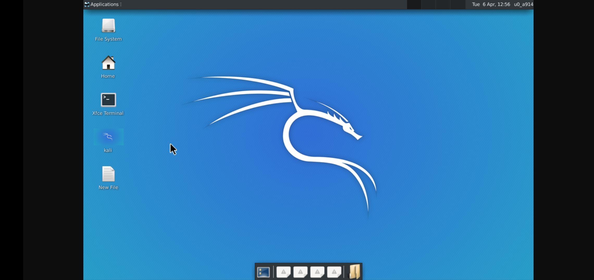
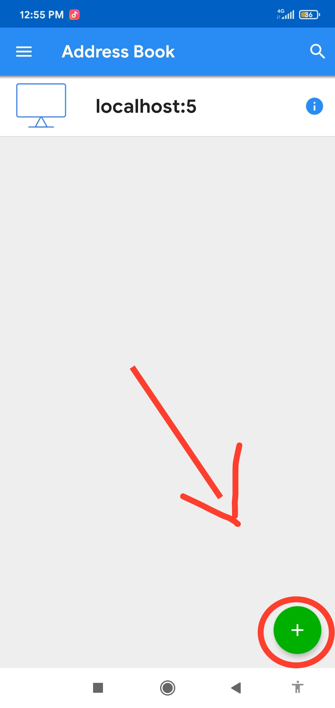
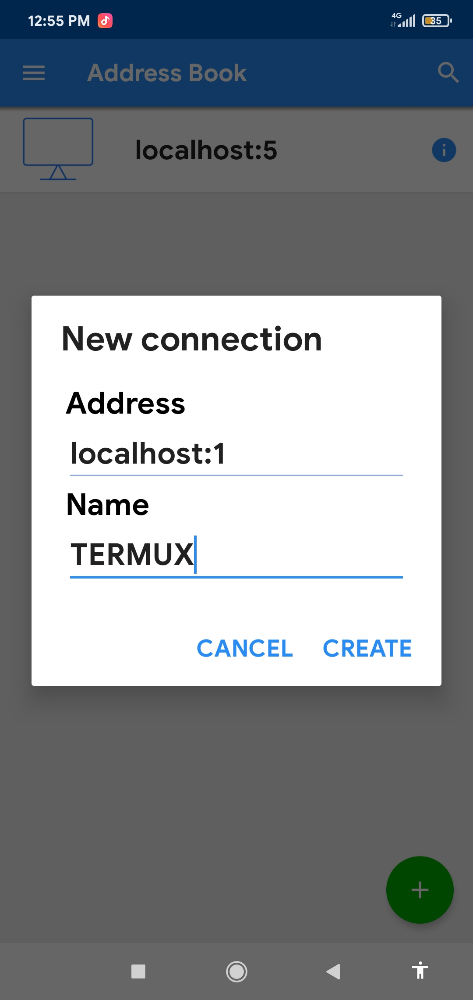
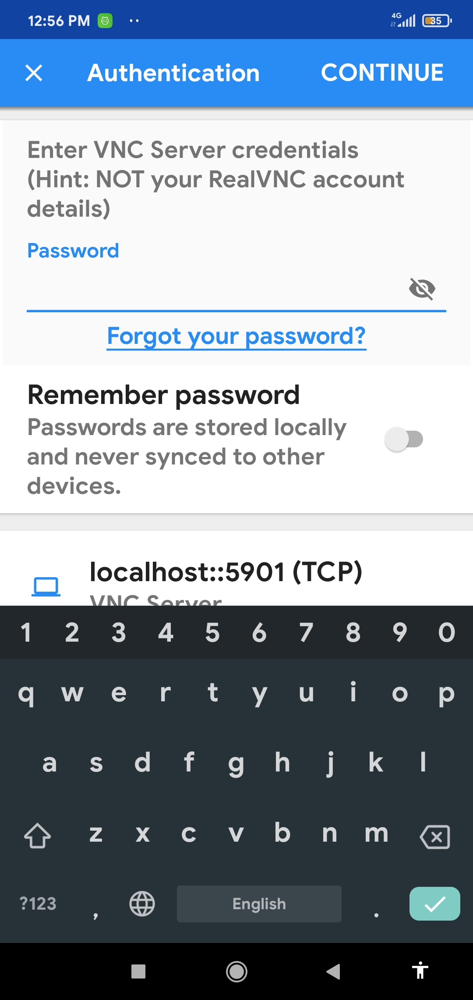

<a href="https://bit.ly/3bgtjYk"><img title="Made in INDIA"

# termux-desktop
install termux desktop enviroment ( GUI ) in just few command

Now you can easily install the termux desktop / GUI in just few or one command . In this shell script you will get high resolution and HD GUI of termux desktop .

Let's get started

# installation

- git clone 

- cd termux-desktop

- chmod +x *

- ./install.sh

- vncserver :1 ( then it will ask for password enter your password .)

- then start vnc viewer

- and tap add button and type localhost:1 and continue .

- then enter password and you're done .

# usage 
- to 'kill' vnc server type "vncserver -kill :1 " . enter your display number in place of :1 .

- to 'start' vnc server type "vncserver :1" enter your display number in place of :1 .

- to 'view' running display type "vncserver -list"

# screenshots

# note

If you are not getting a perfect gui and getting a blur gui the change your vnc viewer quality settings to high and then you will get a perfect gui 
